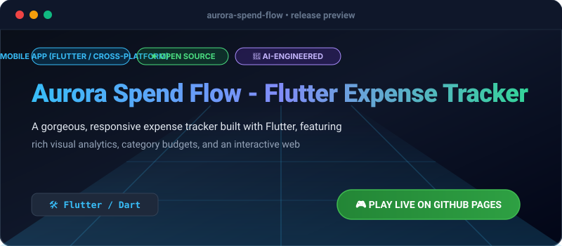

# Aurora Spend Flow - Flutter Expense Tracker

[](https://olamideakinade.github.io/aurora-spend-flow/)
[](https://github.com/Olamideakinade/aurora-spend-flow)
[](https://opensource.org/licenses/MIT)



> 🚀 **Live Demo Available:** Test and play this project live right now: **[https://olamideakinade.github.io/aurora-spend-flow/](https://olamideakinade.github.io/aurora-spend-flow/)**

[](https://opensource.org/licenses/MIT)
[](https://flutter.dev)
[](https://dart.dev)
[](#)

An exquisite, sleek, and high-performance **personal finance & expense tracking application** built with Flutter and Dart. Designed with a dark glassmorphic theme, smooth reactive animations, and a rich interactive category visualizer.

To allow potential users to instantly try the mobile UI in their browser, this repository includes an **interactive mobile web mockup in the index.html preview**, alongside production-ready Flutter Dart source code files.

---

## ✨ Features

- **📈 Custom Category Analytics**: A lightweight, highly performant vertical bar chart that dynamically resizes and glows according to spending patterns.
- **🎨 Exquisite Dark UI**: Built with deep space purples, electric blues, and vivid category accent colors for a premium finance tracking feel.
- **📱 Smooth Swipe-to-Dismiss**: Instant gesture-based transaction deletion with dynamic snackbar undo recovery.
- **📊 Budget Categorization**: Multi-category mapping including Food, Travel, Leisure, Work, Bills, and Education.
- **⚡ Live Web Simulator**: Test the complete mobile application UX inside a responsive web mockup before compiling to iOS or Android.

---

## 🛠️ Architecture & How It Works

This application is built following standard high-performance Flutter practices:
- **Model Layer (`lib/models/expense.dart`)**: Holds immutable record models, color mappings, and category definitions.
- **Presentation Layer (`lib/main.dart`)**: Uses a reactive `StatefulWidget` implementation for supercharged state handling, custom animations, input verification modal bottom sheets, and native material touch gestures.
- **Responsive UI Scaling**: Adaptive grid layouts and scaling fractions ensure that the custom visual charts look stunning on any screen resolution from small smartwatches to large desktop monitors.

---

## 📂 Project Structure

```
aurora-spend-flow/
├── .gitignore              # Standard ignore configurations
├── index.html              # Stunning interactive smartphone web-preview of the app
├── pubspec.yaml            # Project dependencies & package definitions
└── lib/
    ├── main.dart           # Core entry point & Dashboard widgets
    └── models/
        └── expense.dart    # Expense entity model & helper classes
```

---

## 🚀 Quickstart & Installation

### Prerequisites
- Install [Flutter SDK](https://docs.flutter.dev/get-started/install) (version `3.0.0` or higher).
- Ensure you have a target emulator or connected physical device.

### Step 1: Clone the Repository
```bash
git clone https://github.com/your-username/aurora-spend-flow.git
cd aurora-spend-flow
```

### Step 2: Fetch Dependencies
```bash
flutter pub get
```

### Step 3: Run the Application
```bash
# Run on any connected device/emulator
flutter run
```

### Step 4: Build for Production
```bash
# Build Android APK
flutter build apk --release

# Build iOS App Bundle
flutter build ipa --release
```

---

## 🌐 Interactive Web Preview

Simply open `index.html` in any web browser to instantly run a beautiful simulated preview of the interactive tracker. Add items, delete them, and watch the custom SVG analytics charts recalculate and transition live!

---

## 📝 License

This project is licensed under the MIT License. See the [LICENSE](LICENSE) file for details.
